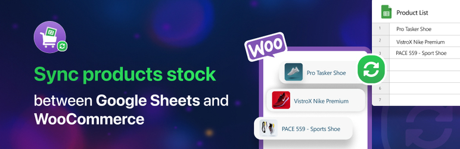
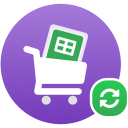

## [ _Stock Sync with Google Sheet for WooCommerce_](https://wordpress.org/plugins/stock-sync-with-google-sheet-for-woocommerce/#developers " _Stock Sync with Google Sheet for WooCommerce_")

##### Contributors: [WPPOOL](https://wppool.dev/ "WPPOOL"), [AR. Arif](https://www.linkedin.com/in/arifur-rahman-arif-51222a1b8/ "AR. Arif")

##### Version: 1.0.0

##### Description

---

Manage your **WooCommerce** products with Google Sheet. Activate and setup for once & manage your products with less efforts.

Ever thought of managing your eCommerce inventory from a simple spreadsheet? We usually update the product details individually after bringing a product to our stores. We need to enter the site dashboard often for managing our store products. Why don’t make it simple? **Just edit a simple Google SpreadSheet and auto-sync data with the site dashboard.** 🤠

Stock Sync with Google Sheet for WooCommerce, the most advanced inventory management solution that has the latest feature of the two-directional synchronization option. Running an eCommerce business? Own a WooCommerce store? One of the main things you want is to make sure to keep track of your inventory and always keep it updated. Keeping a Google Sheet is easier to update and manage than entering your site dashboard repeatedly for each product. 💁‍♂️

🎡 Edit almost everything from your linked spreadsheet and make an auto-update on your main eCommerce site. Let your customers always be engaged with your updated site. 🤘

👉 On top of that, there is another thought of reupdating the sheet when you update info on your site. You don't need to bear any hassle to update the same thing in two places. The plugin is two-directional synchronized. You update the sheet and it'll auto sync on the site dashboard. Or you update the site dashboard and it’ll auto sync on the Google SpreadSheet. Remove your endless hassle for managing your store. 🛒

🚀 It is a hard job to manage the store inventory as a store owner. To keep an updated track record of all time managing a SpreadSheet is easier and organized. Save your time, boost up work efficiency. 🔥

#### Stock Sync with Google Sheet for WooCommerce Features:

-   🔀 **Export products:** Get all your store products details in one place in an organized way on a simple spreadsheet. All you need to do is just activate the plugin, open a Google SpreadSheet, connect the sheet to your site dashboard and follow the steps for exporting all the stock details. Simple, organized, and hassle-free.

-   🎁 **Update almost everything:** Not only exporting data, easily update all the stock data from the sheet to your site dashboard. You’ll get edit access to the site dashboard from the sheet both in one place. Edit product name, details, pricing, on-sale updates, product type, stock status, etc. in one go. Managing your store is easier now.

-   🔄 **Auto-sync in a two-directional path:** Editing the sheet and syncing with the site is not all. Stock Sync with Google Sheet for WooCommerce plugin automatically syncs in a two-directional path. You update your sheet and the site dashboard gets auto-updated. You update details on the site dashboard your Google Sheet gets an automatic update. Stock management is getting simpler.

-   💥 **No place for mistakenly adding or removing products:** For maintaining a new product launch in your store or to remove one you’ll not get edit access from the sheet. So, products won’t be overlapped mistakenly which happens on sheet management often. This feature is for managing the store avoiding major mistakes while you’re in rush. For placing or removing any product from your WooCommerce site you’ll need to do it manually from the dashboard, not from the sheet.

-   🔁 **Sync button:** Get a sync button on your site dashboard. After adding or removing a new product on your WooCommerce store just click on the button. Your Google Sheet will get an auto-sync with the site. Get an automatic update with the new change on the site on your sheet with just one click.

-   💫 **Variable product:** Get different rows for variable products of your store. Variable products won’t confuse you while updating. Put different data on the created different rows for your variable products. Manage simple, variable, grouped each type of product of your stock in one place.

---

#### Releases

-   Initial release
